# 🛒 ModernStore – Full Stack E-Commerce Website

ModernStore is a **full-stack e-commerce web application** built using **Node.js, Express, MongoDB, and Vanilla JavaScript**.
It provides a modern shopping experience with authentication, product browsing, cart management, and responsive UI.

This project demonstrates **full-stack development skills**, including backend API development, database integration, authentication, and responsive frontend design.

---

## 🚀 Features

### 🧑‍💻 User Features

* User Signup & Login (JWT Authentication)
* Secure password hashing using **bcrypt**
* Product listing with search and sorting
* Add products to cart
* Dynamic cart count
* Remove items from cart
* Contact form
* Responsive mobile navigation
* User profile dropdown
* Local storage cart per user

### ⚙️ Backend Features

* REST API built with **Express.js**
* Authentication using **JSON Web Tokens (JWT)**
* Secure password storage with **bcrypt**
* MongoDB database connection
* User account management
* Environment variables for security

### 🎨 Frontend Features

* Fully responsive design
* Modern navigation bar with mobile toggle
* Product grid layout
* Cart UI
* Clean footer section
* Font Awesome icons

---

## 🏗️ Tech Stack

### Frontend

* HTML5
* CSS3
* JavaScript (ES6)

### Backend

* Node.js
* Express.js

### Database

* MongoDB
* MongoDB Atlas (Cloud Database)

### Authentication

* JSON Web Token (JWT)
* bcrypt

---

## 📁 Project Structure

```
E-COMMERCE-WEBSITE
│── assets
│   └── 
├── server
│   └── server.js
│
├── public
│   ├── index.html
│   ├── products.html
│   ├── cart.html
│   ├── contact.html
│   ├── login.html
│   ├── signup.html
│
│   ├── css
│   │   └── style.css
│
│   ├── js
│   │   └── index.js
│
│   └── images
│
├── package.json
└── README.md
```

---

## ⚡ Installation & Setup

### 1️⃣ Clone the Repository

```
git clone https://github.com/yourusername/modernstore.git
cd modernstore
```

---

### 2️⃣ Install Dependencies

```
npm install
```

---

### 3️⃣ Create Environment Variables

Create a **.env** file in the root directory.

```
MONGO_URI=your_mongodb_connection_string
JWT_SECRET=your_secret_key
PORT=3000
```

---

### 4️⃣ Start the Server

```
node server/server.js
```

or

```
npm run dev
```

Server will run on:

```
http://localhost:3000
```

---

## 🌐 Deployment

The project can be deployed using:

Frontend:

* Vercel
* Netlify

Backend:

* Render
* Railway

Database:

* MongoDB Atlas

---

## 📸 Screenshots

### Home Page
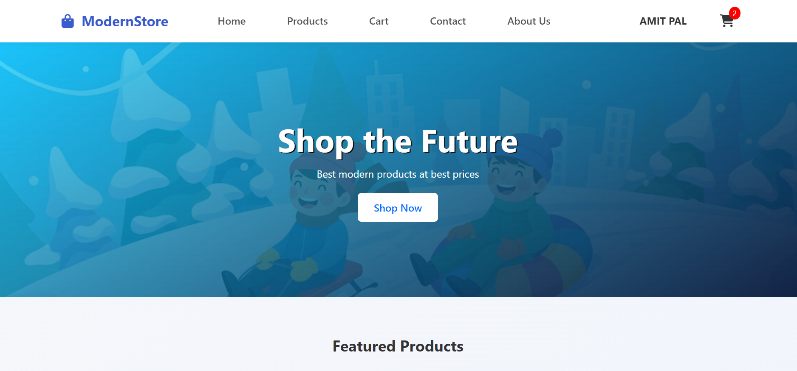
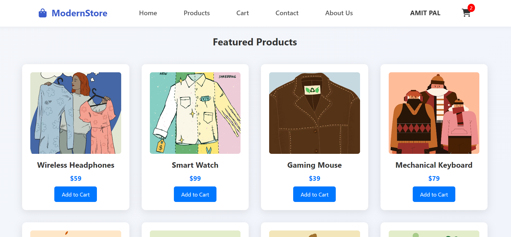
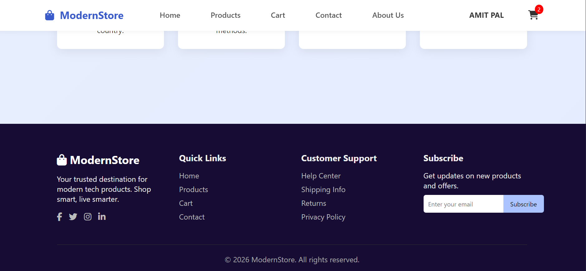
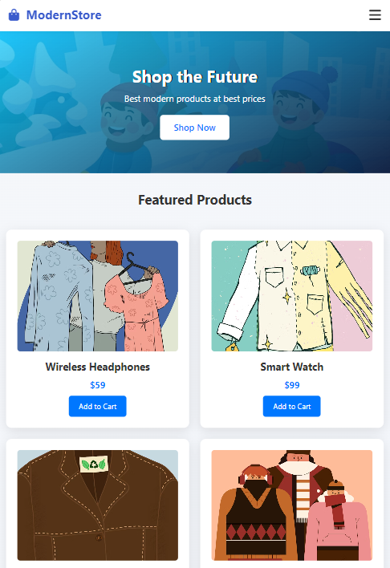

Modern product listing with responsive layout.

### Product Page
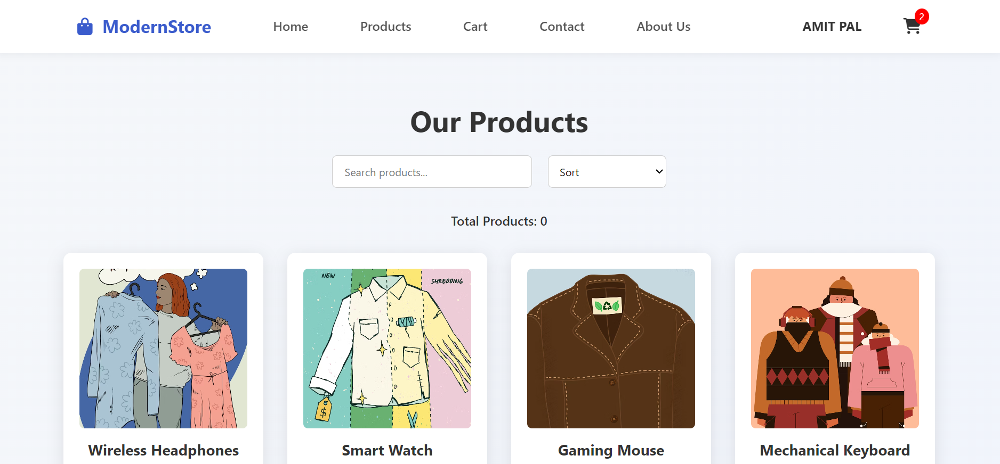
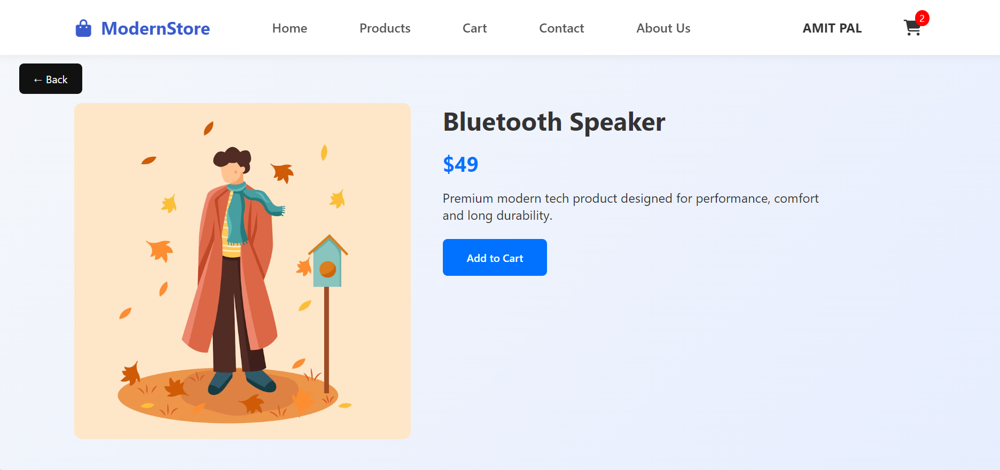
Browse and add products to cart.

### Cart Page
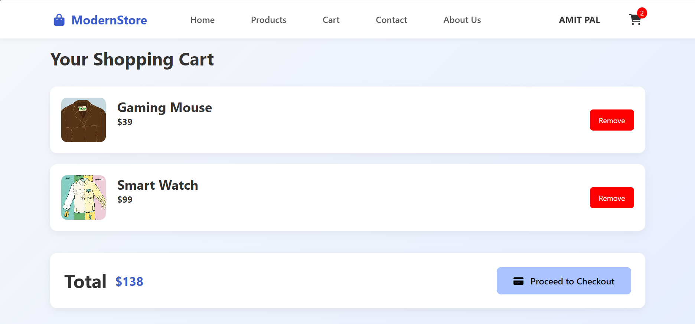
Manage selected products.

### Contact Page
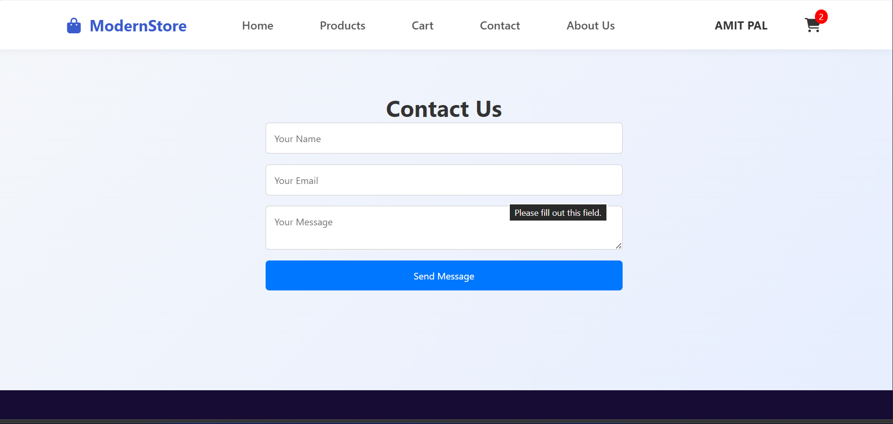
Manage all queries with contact information.

### Product Page
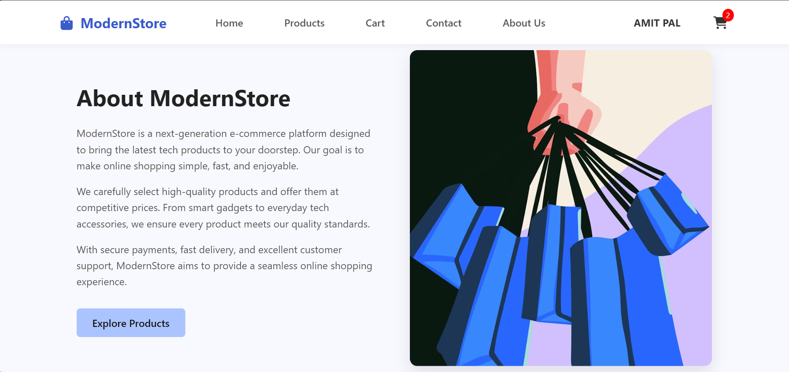
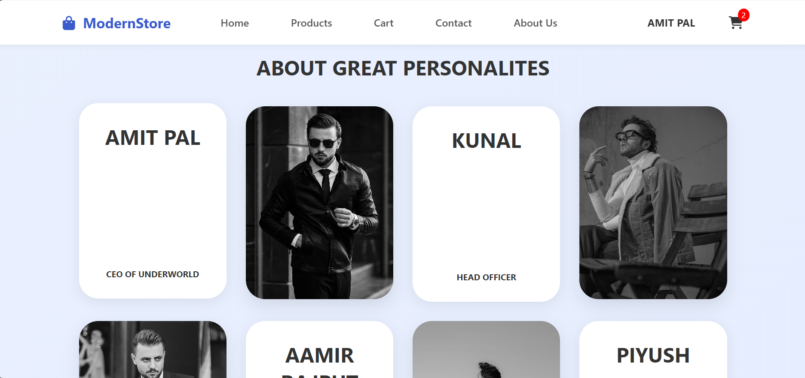
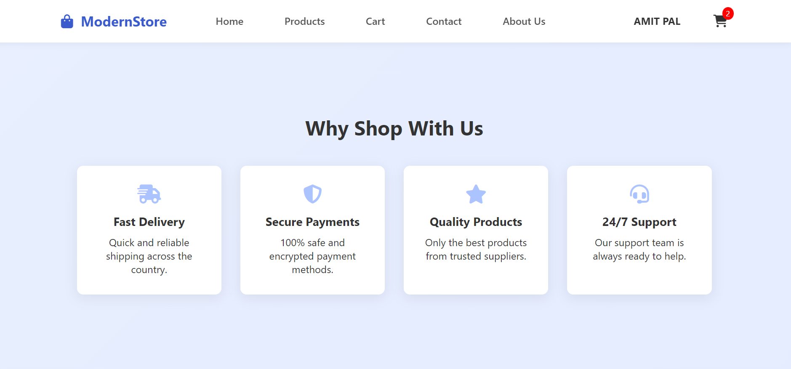
Here is modern about use page with features
### Authentication
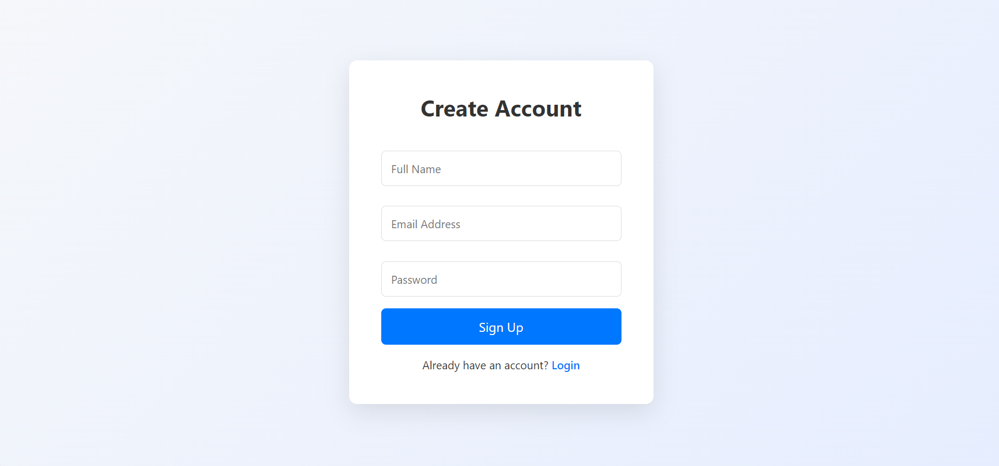
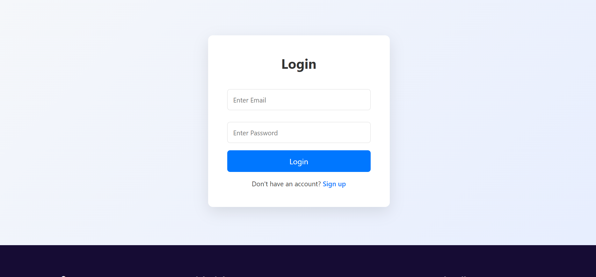
Secure login and signup system.

---

## 🔐 Security Practices

* Passwords stored using **bcrypt hashing**
* Authentication with **JWT tokens**
* Environment variables for secrets
* MongoDB Atlas secure connection

---

## 📈 Future Improvements

* Product details page
* Order history system
* Payment gateway integration (Stripe)
* Admin dashboard
* Product management panel
* Wishlist feature
* Database-based cart system

---

## 👨‍💻 Author

**Amit Pal**

* GitHub: https://github.com/yourusername
* LinkedIn: https://linkedin.com/in/yourprofile

---

## ⭐ Support

If you like this project, consider giving it a **⭐ on GitHub**.

It helps the project grow and supports open-source development.
